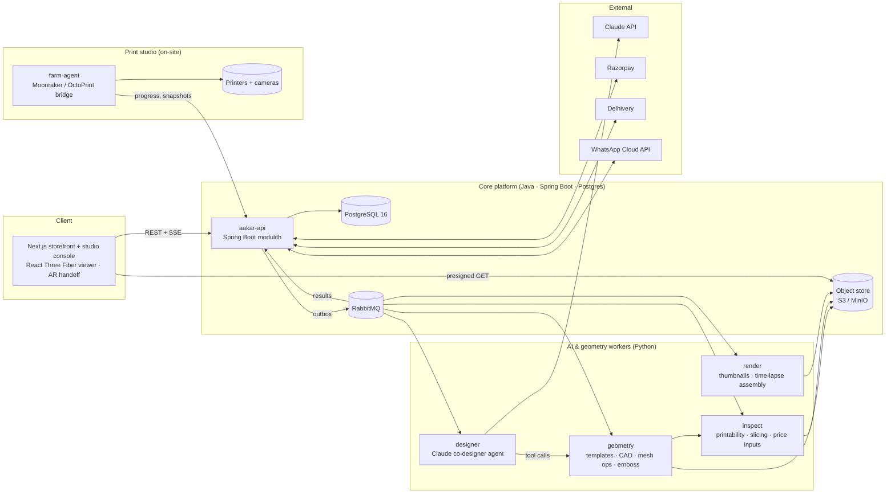
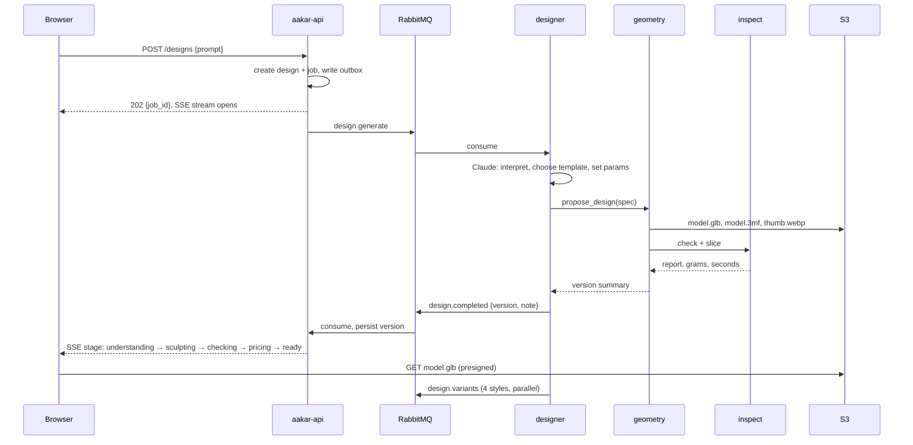

# Aakar — Product & Engineering Plan

> **Aakar** (आकार, *form / shape*) is an AI-assisted 3D printing studio. Describe an object in plain English or Hinglish, sculpt it in 3D in the browser, and have the physical piece printed and shipped anywhere in India.
>
> Tagline: *Things you imagine, made real.*

| | |
|---|---|
| Status | Draft v0.1 |
| Date | 26 Sep 2026 |
| Owner | Chandan Bharadwaj |
| Inputs | Product brief (this repo's initiating request) · `KalaForge AI-Assisted 3D Studio.zip` (exported concept boards, logo, loader) |

---

## Contents

1. [Where we are](#1-where-we-are)
2. [Product principles](#2-product-principles)
3. [Reconciling the brief with the design boards](#3-reconciling-the-brief-with-the-design-boards)
4. [Scope and phasing at a glance](#4-scope-and-phasing-at-a-glance)
5. [Architecture](#5-architecture)
6. [Backend — Spring Boot](#6-backend--spring-boot)
7. [AI and geometry pipeline — Python](#7-ai-and-geometry-pipeline--python)
8. [Frontend and the 3D experience](#8-frontend-and-the-3d-experience)
9. [Data model](#9-data-model)
10. [API surface](#10-api-surface)
11. [Fulfilment and studio operations](#11-fulfilment-and-studio-operations)
12. [Payments, shipping, notifications, compliance](#12-payments-shipping-notifications-compliance)
13. [Non-functional requirements](#13-non-functional-requirements)
14. [Roadmap and milestones](#14-roadmap-and-milestones)
15. [Team and workstreams](#15-team-and-workstreams)
16. [Risks and mitigations](#16-risks-and-mitigations)
17. [Open decisions](#17-open-decisions)
18. [Repository layout and immediate next steps](#18-repository-layout-and-immediate-next-steps)

---

## 1. Where we are

The repository currently holds one design export. Everything below builds on it.

### 1.1 Design boards already produced

| Board | Screens | What it settles |
|---|---|---|
| 01 · Home | Desktop, mobile | Hero copy, central prompt bar with example prompts, three entry points (Shop · Create · Remix) |
| 02 · Shop | Desktop, mobile | Categories (Home & decor, Nameplates, Kitchen, Desk & tech, Gifting), card layout with specs, "Add to Cart" + "Modify with AI" on every card, six launch SKUs with ₹ prices |
| 03 · Create | Desktop, mobile | Three-column layout (prompt/chat · viewer · finishes), three generated options, finish chips, Telugu text emboss, "View in my room", four style variations, live weight/height/print-time/price |
| 03 · AR | Placing, placed | 1:1 AR placement, finish and size (S/M/L) switch inside AR, add to cart from AR |
| 04 · Remix | Desktop, mobile | Before/After, stability badge, change log ("3 edits"), karigar's note explaining edits, follow-up chips, upsell prompt ("smartwatch dock?"), price delta (+₹90 · +12 g) |
| 05 · Checkout | Desktop, mobile | Four steps (Review · Stability · Pay · Track), stability report (centre of gravity, thinnest wall, load on stem), transparent price breakdown, UPI / card / net banking, address |
| 06 · Order tracking | Desktop | Live stage, studio + printer bay + layer height, ETA |
| 06 · WhatsApp | Mobile | 5-second time-lapse mid-print ("Layer 212 of 480"), next stage, ETA |
| 07 · Unboxing | Desktop | Brown box, marigold tape, card: "Designed by You. Crafted by Aakar.", reprint/remix short link |

Also included: the **Bloom** logo (three outlined jaali petals, one solid petal), one-piece variants, and an animated SVG loader.

### 1.2 Brand identity as exported

| Token | Value |
|---|---|
| Cream (page) | `#F5F0E6` |
| Paper (cards) | `#FBF8F1` |
| Sand | `#ECE3D2` |
| Line | `#E3DACA` |
| Ink (text) | `#2A2F3A` |
| Indigo | `#34426B` |
| Terracotta | `#B56E52` |
| Marigold | `#D8AE5B` |
| Sage | `#7E9A7B` |
| Display type | Cormorant Garamond |
| UI type | Manrope |
| Background pattern | Subtle diamond jaali lattice at 6% opacity |

---

## 2. Product principles

These decide trade-offs when the brief and engineering pull in different directions.

1. **Printable by construction.** We never show a model we cannot manufacture. Geometry comes from constrained parametric templates first, and every version passes a printability check before it can be priced or bought.
2. **Craft, not CAD.** Every word in the UI speaks the language of making. We "sculpt", "weave", "emboss"; we never say mesh, vertex, or STL to a customer.
3. **Proven bases, personal tops.** Personalisation sits on top of templates that have been printed hundreds of times. This is what lets Remix promise "it won't tip over".
4. **Transparent price, honest preview.** Price comes from real slicer output. Digital materials are calibrated against photographs of real prints in the same finish.
5. **Magic moments are engineered.** Time-lapse on WhatsApp, the unboxing card, "View in my room": each is a first-class feature with an owner, a metric, and a fallback.

---

## 3. Reconciling the brief with the design boards

The brief and the exported boards diverge in a few places. Recommendations below; final calls are listed in [§17](#17-open-decisions).

| Topic | Brief says | Boards show | Recommendation |
|---|---|---|---|
| Surface theme | Deep indigo backgrounds throughout | Cream "paper" pages, indigo as accent | Cream for browsing and checkout (readability, warmth). **Deep indigo as the immersive stage** for the 3D viewer, Create and AR screens, where lit objects need a dark backdrop. Same palette, two surfaces. |
| Style variants | Three (Jaipur Heritage, Modern Zen, Cyber-Desi) | Four (adds Warli Line) | Four. Warli is the strongest regional differentiator. |
| Journey names | Bazaar · Canvas · Karigar | Shop · Create · Remix | Nav labels stay **Shop · Create · Remix** for clarity. Bazaar, Canvas and Karigar become internal codenames and brand-copy flourishes (e.g. "Your karigar's note"). |
| Typography | Clean sans-serif | Cormorant Garamond display + Manrope UI | Keep the boards. The serif carries the "craft" tone. |
| Loading | Rotating mandala | Bloom draw-on loader + mandala in Create | Both: Bloom for page and route loads, mandala with stage text ("Weaving your design…") for generation. |
| Order ID prefix | — | `KF-20931` (KalaForge legacy) | `AK-` prefix. Rename the zip and any remaining KalaForge references. |
| Regional embossing | Telugu example | Telugu example | **Decided (ADR-0003):** all seven scripts at launch: Latin, Devanagari, Telugu, Tamil, Kannada, Bengali, Gujarati. |

---

## 4. Scope and phasing at a glance

| Phase | Weeks | Theme | Ships |
|---|---|---|---|
| 0 | 1–2 | Foundations | Monorepo, design tokens, CI, local stack, first template end-to-end |
| 1 | 3–10 | **Shop + Remix-lite (MVP, revenue)** | Parametric catalog (8–12 SKUs), 3D viewer with finishes, text emboss, size sliders, slicer-backed pricing, Razorpay checkout, order tracking, WhatsApp status |
| 2 | 11–18 | **Create + Co-Designer** | Natural-language generation onto template families, chat modifications, four style variants, stability report, upsells, contextual environments, time-lapse pipeline |
| 3 | 19–28 | Freeform and immersive | Generative hero surfaces behind an adapter, motif drag-and-drop with curved wrap, morph nodes, WebXR "View in my room", multi-studio routing |
| 4 | 29+ | Scale | Designer-submitted templates, social sharing of time-lapses, B2B gifting, regional-language UI |

The MVP is deliberately **Shop-first**. It exercises the whole physical loop (design → price → pay → print → ship → unbox) with deterministic geometry, so the AI work in Phase 2 lands on a proven fulfilment pipeline.

---

## 5. Architecture

### 5.1 Overview



### 5.2 Stack and rationale

| Layer | Choice | Why |
|---|---|---|
| Storefront | Next.js 15 (App Router), TypeScript, Tailwind, React Three Fiber + drei, Zustand | SSR for SEO on Shop pages; R3F is the most productive way to build a tactile viewer; one codebase for storefront and studio console |
| AR | `<model-viewer>` for handoff (iOS Quick Look via USDZ, Android Scene Viewer via GLB); WebXR via three.js where supported | Reaches every phone on day one; WebXR upgrade path without rewriting |
| API | Java 21, Spring Boot 3.x, Spring Modulith, Spring Security, Spring Data JPA, Flyway | Your home stack; Modulith keeps a single deployable with enforced module boundaries, cheap to split later |
| Database | PostgreSQL 16 (JSONB for design specs and reports) | Source of truth for everything; JSONB avoids schema churn on fast-moving spec formats |
| Messaging | RabbitMQ (Spring AMQP · Python `aio-pika`), Postgres outbox | Reliable Java↔Python job dispatch, dead-letter queues, per-job-type routing |
| Object store | S3 (ap-south-1) · MinIO locally | GLB/3MF/STL/renders/videos served via CloudFront with presigned URLs |
| AI agent | Python 3.12, FastAPI, `anthropic` SDK | Your agents stack; tool-runner and structured outputs map directly to the design-spec workflow |
| CAD kernel | build123d / CadQuery (OCCT) | Real B-rep solids, exact fillets and booleans, STEP export for archival |
| Mesh ops | trimesh, manifold3d, pymeshlab, Open3D | Fast booleans, repair, decimation, centre of mass, ray-cast wall thickness |
| Text shaping | HarfBuzz (uharfbuzz) + FreeType + Noto fonts | Correct Indic conjunct shaping before extrusion |
| Slicer | PrusaSlicer or OrcaSlicer CLI | Print time and filament grams for pricing; G-code for the farm |
| Realtime | Server-Sent Events from Spring | One-way progress streams; simpler than WebSockets behind load balancers |
| Infra | **Local Docker Compose for now** (ADR-0006). Candidate for later: AWS ap-south-1 with ECS Fargate, RDS Postgres, Amazon MQ, S3 + CloudFront, Secrets Manager | The owner wants to play with the product locally first; India data residency and managed services when production is scheduled |
| Observability | OpenTelemetry end to end, Grafana stack | Trace a design from prompt → Java → queue → Python → slicer |
| CI/CD | GitHub Actions: Gradle build/test, pytest, Playwright, Docker images, Terraform plan | One pipeline for the monorepo |

---

## 6. Backend — Spring Boot

A single Spring Boot application organised as a **Modulith**. Modules communicate via application events and public APIs only; Modulith's verification test fails the build on illegal cross-module access.

| Module | Responsibility | Key patterns |
|---|---|---|
| `identity` | Phone OTP + Google sign-in, JWT access/refresh, guest sessions that attach to an account on login | Spring Security resource server; guest `design` ownership transfer |
| `catalog` | Items, categories, media, template references, digital materials ↔ filament SKUs | Read-mostly, cached; slugs for SEO |
| `design` | Designs, immutable `design_versions`, conversation log | Every edit is a new version with a parent; nothing is mutated |
| `studio` | Generation job orchestration: accept, enqueue, track stages, publish SSE | Outbox → RabbitMQ; idempotent result handlers; per-user concurrency limits |
| `pricing` | Price snapshot per version × material from inspect results | Pure functions over `PricingPolicy`; snapshot frozen into cart and order |
| `cart` | Carts for guests and users | Merge on login |
| `order` | Orders, items, state machine, events | `order_events` append-only; SSE for tracking page |
| `payment` | Razorpay orders, webhook verification, refunds, invoices | Idempotency keys; signature verification; reconciliation job |
| `fulfilment` | Print jobs, printer assignment, stage transitions, QC, reprint | Receives farm-agent progress; ops console endpoints |
| `shipping` | Delhivery serviceability, rate, AWB, tracking webhooks | Rate card by weight slab × zone |
| `notification` | WhatsApp templates, email, in-app | Opt-in registry; template versioning |
| `media` | Presigned upload/download, asset registry, checksums | Short-TTL URLs; virus scan hook for user uploads (motif images later) |
| `share` | Public short links (`/k/{code}`) from the unboxing card → reprint or remix | Rate-limited, read-only |
| `admin` | Staff authentication and the management portal's API: pricing policies (versioned), materials, catalog, live templates, printers, fulfilment ops, audit log | Separate staff accounts; every change audited (ADR-0012) |

Cross-cutting: Flyway migrations, jOOQ or JPA (JPA fine to start), Bean Validation on all DTOs, ProblemDetail error responses, Micrometer metrics, OpenAPI spec generated and published to `packages/contracts`.

---

## 7. AI and geometry pipeline — Python

This is the hardest part of the product and the section most worth reading twice.

### 7.1 Strategy: parametric first, generative second

Freeform text-to-3D models produce meshes that look convincing but are routinely non-manifold, thin-walled, hollow in the wrong places, and impossible to edit with instructions like "make the back 18 mm wider". A studio that promises the physical product matches the on-screen model cannot build on that alone.

Aakar therefore treats geometry in two tiers:

| Tier | Source | Used for | Guarantees |
|---|---|---|---|
| **Parametric** (Phases 1–2) | Our own build123d template scripts with typed parameters, constraints and feature slots | Every Shop item, every Remix, and Create prompts that map to a template family | Manifold, printable, priceable, editable, deterministic |
| **Generative** (Phase 3) | Text/image-to-3D behind an adapter interface (hosted vendor or self-hosted open model) | "Hero surfaces" and ornaments inside a bounded region of a parametric body, then repaired and thickened | Best effort, always followed by repair and the full printability gate |

The LLM never writes executable geometry code. It produces a **Design Spec**; our code turns the spec into geometry. This is both the safety boundary and the reason results are reproducible.

### 7.2 The Design Spec

A versioned JSON document, validated against a JSON Schema published in `packages/contracts`.

```json
{
  "spec_version": "1.0",
  "family": "table_lamp",
  "template": "lotus_lamp@2",
  "params": { "height_mm": 180, "petal_count": 8, "base_diameter_mm": 110, "shade_wall_mm": 1.6 },
  "features": [
    { "type": "emboss_text", "text": "విరాజ్", "script": "telugu",
      "font": "NotoSansTelugu-SemiBold", "depth_mm": 1.2,
      "anchor": "base_front", "projection": "cylindrical" },
    { "type": "motif", "motif_id": "warli_dancers_01",
      "anchor": "shade_band", "scale": 0.8, "mode": "deboss" }
  ],
  "style": "jaipur_heritage",
  "material": "terracotta_silk",
  "constraints": { "min_wall_mm": 1.2, "max_overhang_deg": 55, "bed_mm": [250, 250, 250] }
}
```

Each template publishes its parameter schema (ranges, units, human labels, which parameters are exposed as morph handles) and its **anchors** (named surfaces where text and motifs may land).

### 7.3 Launch template families

Twelve families cover the six SKUs on the Shop board plus the brief's examples. Each family ships with one to three templates.

| Family | Example templates | Anchors | Notes |
|---|---|---|---|
| `phone_stand` | Jharokha arch, minimalist wedge | side_left, side_right, back | Load test target 380 g |
| `headphone_stand` | Pillar, arch | base_front, pillar | Upsell: smartwatch dock on base |
| `planter` | Fluted, faceted, hanging | band, rim | Drainage tray as sub-part |
| `coaster_set` | Ajrakh, block-print, monogram | face | Multi-part order; heat-safe material only |
| `nameplate` | Kantha border, temple arch, modern bar | face, border | Raised letters; screw or adhesive mount |
| `bookend` | Elephant, arch, geometric | face | Weighted cavity for sand or steel shot |
| `table_lamp` | Lotus, jaali cylinder | base_front, shade_band | Bought-in lamp module; shade wall translucency |
| `diya_holder` | Single, five-wick, floating | rim | Heat-resistant material gate |
| `pooja_accessory` | Modular shelf, bell hook, agarbatti stand | face | Respectful-content policy applies |
| `wall_hook` | Paisley, lotus, arrow | face | Load rating shown |
| `desk_organizer` | Tray with phone slot, pen cup | front | Modular grid |
| `car_accessory` | Vent phone mount, dashboard tray | face | Dashboard environment |

### 7.4 The Co-Designer agent

The `designer` service runs a Claude agent whose only way to change geometry is through typed tools that call the `geometry` and `inspect` services.

**Models**

| Job | Model | Effort | Why |
|---|---|---|---|
| Design reasoning: interpret the prompt, choose family, set parameters, plan edits, write the karigar's note | `claude-opus-5` | `high` | Multi-step tool use over geometric constraints; quality here is the product |
| Intent routing, language detection, content-policy pre-check, variant and upsell copy | `claude-sonnet-5` | `low` | High volume, low stakes, 2.5× cheaper than Opus 5 |
| Bulk offline jobs (catalog copy, alt text, eval grading) | `claude-haiku-4-5` | — | Cheapest; use Message Batches |

Anthropic list prices at time of writing: Opus 5 $5 / $25 per million input/output tokens, Sonnet 5 $2 / $10, Haiku 4.5 $1 / $5. Budget assumption: one Create session with three edits costs well under ₹10 in tokens with prompt caching on.

**Tools exposed to the agent** (all `strict: true`, schemas in `packages/contracts`)

| Tool | Does |
|---|---|
| `search_templates(query, family?)` | Returns matching templates with parameter schemas and anchors |
| `propose_design(spec)` | Validates spec, builds geometry, returns dims, mass, preview URL, printability summary |
| `modify_design(version_id, param_deltas, feature_ops)` | Applies edits as a new version from a parent |
| `add_text(version_id, text, anchor, depth_mm, projection)` | Shapes and embosses text |
| `add_motif(version_id, motif_id, anchor, scale, mode)` | Places a library motif |
| `apply_style(version_id, style)` | Produces a Style Multiverse variant |
| `check_printability(version_id)` | Full stability and wall report |
| `estimate_price(version_id, material)` | Price breakdown |
| `suggest_upsells(spec)` | Rule table plus LLM ranking; returns at most one suggestion |

**Behaviour**

- The agent replies with a short **karigar's note** (what changed, why, in one to three sentences) plus follow-up chips. The Remix board copy is the target register.
- Hinglish and mixed-script prompts are handled natively; the agent detects the script of any text to emboss and picks the font.
- If a request cannot be made printable within constraints, the agent says so and offers the nearest printable alternative. It never silently downgrades.
- Content policy: a Sonnet pre-check flags weapons and weapon lookalikes, trademarked logos, hateful imagery, and disrespectful use of religious iconography. Flagged prompts go to a human review queue rather than a hard refusal where intent is ambiguous.

**Engineering notes**

- Python `anthropic` SDK with the tool runner (`@beta_tool`) and adaptive thinking; structured outputs for the final spec.
- Prompt caching: system prompt, tool definitions and template catalog are stable and go first; the conversation goes last. Track `cache_read_input_tokens` in metrics.
- Handle `stop_reason: "refusal"` explicitly and surface a friendly message.
- Conversation state lives in Postgres (`design_messages`) so a session can resume across devices and be replayed for debugging.
- Evaluation set from day one: 200 prompts (English, Hinglish, Telugu-mixed) with expected family and key parameters; 100 edit instructions with expected parameter and sign ("wider back" → `back_width_mm` increases). Track intent accuracy and printability pass rate per release.

### 7.5 Text and motif embossing

1. Shape the string with HarfBuzz for the detected script (Telugu conjuncts and vowel signs must be shaped before outlines are extracted).
2. Extract glyph outlines with FreeType, tessellate to polygons, extrude to `depth_mm`.
3. Project onto the anchor surface: planar (nameplates), cylindrical (lamp bases, planters) in Phase 1–2; conformal UV mapping for arbitrary curved surfaces in Phase 3.
4. Boolean union (emboss) or difference (deboss) with the body via manifold3d.
5. Enforce minimum stroke width for the chosen nozzle (0.4 mm nozzle → 0.8 mm minimum stroke; scale the font weight or warn).

Motifs are curated SVGs (Warli, Paisley/Kalka, Lotus, Ajrakh, Kantha, Jharokha, Elephant, Peacock) with metadata: default scale, allowed modes, tiling rules for bands. Same projection pipeline as text.

### 7.6 Style Multiverse variants

Each template declares which style transforms it supports. Variants are generated in parallel after the first result and cached against the parent version.

| Variant | Transform |
|---|---|
| Jaipur Heritage | Jaali lattice cut pattern on designated panels, respecting minimum bridge width |
| Modern Zen | Increase fillet radii toward maximum, remove decorative features, pebble profile |
| Cyber-Desi | Replace fillets with chamfers, add faceted panel lines, sharpen silhouette |
| Warli Line | Tribal linework motif band debossed around the primary anchor |

### 7.7 Morph nodes

Templates mark parameters as `handle: true` with a screen-space anchor. The viewer renders glowing handles; dragging previews the change client-side via cage deformation, and on release posts the new parameter value. The server regenerates the true geometry (parametric, so a few seconds) and swaps the preview. Printability is re-checked on every regeneration.

### 7.8 Freeform generation (Phase 3)

An adapter interface `GenerativeProvider.generate(prompt, region_bounds) -> mesh` with two implementations: a hosted vendor API and a self-hosted open model on a GPU spot pool. Output is repaired (pymeshlab), thickened to `min_wall_mm`, clipped to the region, and unioned onto the parametric body. The printability gate is not optional here.

### 7.9 Printability and stability check

The `inspect` service produces a report per version. The Checkout board's stability card is rendered directly from it.

| Field | Method | Phase |
|---|---|---|
| `manifold`, `watertight` | trimesh checks after repair | 1 |
| `bounds_mm`, `fits_bed` | Bounding box vs studio printer beds | 1 |
| `mass_g`, `volume_cm3` | Slicer filament output × material density (accounts for infill) | 1 |
| `thinnest_wall_mm` | Signed-distance sampling / ray casting; fail below 1.2 mm | 1 |
| `cog_offset_mm`, `cog_inside_base` | Centre of mass projection vs convex hull of the contact face | 1 |
| `tipping_margin_mm` | Distance from projected centre of mass to nearest hull edge | 1 |
| `overhangs_unsupported` | Faces beyond 55° from vertical without support material | 2 |
| `load_capacity_kg` | Simple beam and bearing estimate per family; FEA (CalculiX) later | 3 |
| `check_duration_ms` | Wall clock | 1 |

### 7.10 Pricing engine

```
price = round_to_9(
    grams          × material_rate[material]
  + print_hours    × machine_rate
  + finishing_fee[finish_class]
  + packaging_fee
) × (1 + margin)
shipping shown separately; free above a threshold
```

The Checkout board implies roughly ₹4.6 per gram for Terracotta Silk and ₹200 per printer hour. Treat those as placeholders until real filament and machine costs are measured. Price snapshots are stored per version × material so cart and order totals never drift from what the customer saw.

**Digital material → filament mapping** (each with density, ₹/g, PBR preset, calibration photo)

| Digital material | Filament |
|---|---|
| Basic White | Matte PLA, white |
| Terracotta Matte | Matte PLA, terracotta |
| Terracotta Silk | Silk PLA, copper-terracotta |
| Polished Brass | Silk PLA, gold |
| Sandalwood Silk | Silk PLA beige or wood-fill PLA |
| Indigo Matte | Matte PLA, navy |

Heat-adjacent families (coasters, diya holders) are restricted to PETG or annealed materials in the template constraints.

### 7.11 Generation flow



Stage text shown to the customer: **Understanding your idea → Weaving your design → Checking physics → Pricing → Ready**.

---

## 8. Frontend and the 3D experience

### 8.1 App structure (Next.js App Router)

```
/                     Home
/shop, /shop/[slug]   Shop (SSR, SEO)
/create               Create (client-heavy)
/create/[designId]    Resume a design
/remix/[slug]         Remix from a Shop item
/ar/[versionId]       AR handoff page
/checkout             Review → Stability → Pay
/orders/[id]          Tracking with live stages
/k/[code]             Public reprint/remix link from the card
(staff screens live in apps/admin, not here — ADR-0012)
```

### 8.2 The viewer

- **React Three Fiber** scene with a fixed camera rig (orbit with limits, double-tap to reset), soft shadows, ACES tone mapping.
- **Contextual environments** chosen by family, each an HDRI plus a light GLB stage: `teak_table_candlelight` (decor, pooja), `desk_oak` (tech), `dashboard` (car), `kitchen_marble` (coasters), `balcony_daylight` (planters), and a neutral `studio` toggle.
- **Digital materials** as PBR presets (colour, roughness, metalness, sheen or clearcoat for silks) keyed to the filament table. Swapping is instant and client-side.
- **Handles** for morph nodes and **anchors** for text and motif drops, drawn as glowing marigold dots that fade when idle.
- **Performance budget**: preview GLB ≤ 3 MB with Draco, ≤ 150k triangles, environments ≤ 2 MB, 60 fps desktop and 30 fps on a mid-range Android phone. Print-quality meshes never go to the browser; they stay server-side.

### 8.3 "View in my room"

`<model-viewer>` with `ar-modes="webxr scene-viewer quick-look"`. The `geometry` service exports GLB for Android and USDZ for iOS at the moment a version is created, at true 1:1 scale. Finish and S/M/L switching inside AR (per the board) swap the source model rather than re-rendering.

### 8.4 Design system

A `packages/design-tokens` package generated from §1.2, consumed by Tailwind and by the R3F material presets, so brand colours and material colours come from one source. Components mirror the boards: prompt bar, SKU card with dual actions, finish chips, variant carousel, stability card, price breakdown, stage timeline.

### 8.5 Loading and motion

Bloom draw-on loader for route transitions; mandala spinner with stage text for generation; subtle jaali background at 6% opacity; reduced-motion respected everywhere.

---

## 9. Data model

PostgreSQL 16. JSONB where the shape moves fast (specs, reports, price snapshots), relational everywhere else. Every mutable business object has `created_at`, `updated_at`; append-only tables have neither update nor delete.

| Table | Key columns | Notes |
|---|---|---|
| `users`, `auth_identities`, `user_addresses` | phone, email, provider, address, pincode | Pincode drives serviceability |
| `catalog_items`, `catalog_item_media` | slug, family, template_ref, base_price, specs JSONB | Shop cards |
| `template_families`, `templates` | family, name, version, param_schema JSONB, anchors JSONB, script_ref | Templates are code; the table indexes them |
| `materials`, `finishes` | digital_name, filament_sku, density, rate_per_g, pbr_preset JSONB | Pricing and rendering share this |
| `designs` | owner_id (nullable for guests), source (`shop`,`create`,`remix`), base_item_id, title, status | One design, many versions |
| `design_versions` | design_id, version_no, parent_version_id, spec JSONB, mass_g, print_seconds, bounds, assets JSONB, printability JSONB, created_by (`agent`,`user`) | Immutable |
| `design_messages` | design_id, role, content, tool_calls JSONB, version_id | Chat log and audit |
| `generation_jobs` | design_id, type, status, stage, attempts, error, timings JSONB | SSE source |
| `motifs`, `fonts` | id, script, file_ref, metadata JSONB | Library |
| `carts`, `cart_items` | version_id, material_id, qty, price_snapshot JSONB | Guest carts merge on login |
| `orders`, `order_items`, `order_events` | number (`AK-…`), status, totals, snapshots | Events append-only |
| `payments`, `invoices` | razorpay_order_id, payment_id, signature, status, gst JSONB | Reconciled nightly |
| `shipments`, `shipment_events` | carrier, awb, status, eta | Webhook-fed |
| `studios`, `printers`, `print_jobs` | studio_id, printer_id, order_item_id, gcode_ref, status, progress_pct, layer, layers_total | Farm agent updates |
| `timelapses`, `media_assets` | s3_key, kind, checksum, duration | Videos and renders |
| `notifications` | user_id, channel, template, status, provider_ref | WhatsApp, email |
| `outbox_events` | aggregate, type, payload JSONB, published_at | Reliable publishing |
| `content_reviews` | design_id, reason, decision, reviewer | Policy queue |

Indexes: GIN on `design_versions.spec`, B-tree on `(design_id, version_no)`, partial index on `generation_jobs(status) WHERE status IN ('queued','running')`. Partition `order_events` and `design_messages` by month once volume warrants.

---

## 10. API surface

REST with JSON, ProblemDetail errors, SSE for progress. OpenAPI is the contract; the TypeScript client is generated.

**Designs and generation**

| Method | Path | Purpose |
|---|---|---|
| `POST` | `/api/designs` | Start from a prompt or from a catalog item; returns design + job |
| `GET` | `/api/designs/{id}` | Design with latest version |
| `GET` | `/api/designs/{id}/versions` | Version history |
| `POST` | `/api/designs/{id}/messages` | Chat instruction → new job |
| `POST` | `/api/versions/{v}/text` · `/motif` · `/params` · `/style` | Direct edits from viewer controls |
| `GET` | `/api/versions/{v}/printability` | Stability report |
| `GET` | `/api/versions/{v}/price?material=` | Price breakdown |
| `GET` | `/api/jobs/{id}/events` | SSE stage stream |

**Commerce**

| Method | Path | Purpose |
|---|---|---|
| `GET` | `/api/catalog/items`, `/api/catalog/items/{slug}` | Shop |
| `GET` `POST` `DELETE` | `/api/cart`, `/api/cart/items/{id}` | Cart |
| `POST` | `/api/checkout` | Creates order and Razorpay order |
| `POST` | `/api/webhooks/razorpay` | Payment events (signature verified) |
| `GET` | `/api/orders/{id}`, `/api/orders/{id}/events` | Tracking and SSE |
| `POST` | `/api/webhooks/delhivery`, `/api/webhooks/whatsapp` | Carrier and messaging callbacks |

**Studio and share**

| Method | Path | Purpose |
|---|---|---|
| `POST` | `/api/studio/print-jobs/{id}/progress` · `/stage` · `/timelapse` | Farm agent and ops console |
| `GET` | `/k/{code}` | Public reprint/remix from the unboxing card |

---

## 11. Fulfilment and studio operations

### 11.1 Order stages

The board shows five customer-facing stages. Internally there are more; the customer sees a collapsed view.

```
CONFIRMED → QUEUED → SLICING → PRINTING → FINISHING → QC → PACKED → SHIPPED → DELIVERED
                                   ↘ ON_HOLD / REPRINT / CANCELLED
```

Customer view: **Queued · Slicing · Printing · Sanding · Shipped** (Finishing and QC are shown as "Sanding").

### 11.2 Farm agent

A Python service running on a small box in the studio.

- Two bridges behind one `PrinterBridge` interface (ADR-0004): **Moonraker** (Klipper) over WebSocket for progress, current layer, state and camera snapshots; **Bambu Lab** over local MQTT in LAN mode with FTPS upload and the local camera stream.
- Captures camera snapshots every few seconds during a print.
- At about 45% progress assembles a **5-second clip** (evenly sampled frames, 24 fps, 720p, ffmpeg) and uploads it; the API sends the WhatsApp template with the video ("Layer 212 of 480"). At completion it assembles the full time-lapse for the share page.
- Posts stage transitions and failures; a failed print creates a `REPRINT` job and notifies ops.

### 11.3 Management portal (`apps/admin`)

A separate, staff-only Next.js app (ADR-0012). Fulfilment ops: queue by printer, one-tap stage advancement for manual steps (sanding, QC, packing), QC photo upload, reprint, content-review queue, daily print schedule, material stock levels. Configuration: pricing policies (ADR-0008), materials and rates, catalog items and availability, live template versions, registered printers (ADR-0004). Every change is audited.

### 11.4 Packaging

Kraft box, marigold tape, sustainable fill, and the printed card: *Designed by You. Crafted by Aakar.* with piece name, finish, studio, date, and the `/k/{code}` short link (QR plus text). Card PDF is generated per order at PACKED.

---

## 12. Payments, shipping, notifications, compliance

| Area | Plan |
|---|---|
| Payments | Razorpay Standard Checkout: UPI (intent and collect), cards including RuPay, net banking, wallets. Webhook signature verification, idempotent handlers, nightly reconciliation, refunds through the API. |
| Invoicing and GST | GST-compliant invoices with sequential numbering. HSN classification for 3D-printed plastic articles and tax rate to be confirmed with a chartered accountant before launch. |
| Shipping | Delhivery: serviceability at address entry, rate by weight slab and zone, AWB creation at PACKED, tracking webhooks into `shipment_events`. Free shipping above a threshold, otherwise shown transparently. |
| WhatsApp | Meta WhatsApp Cloud API through a business solution provider. Opt-in at checkout. Templates: order confirmed, printing time-lapse (video), shipped with tracking, delivered with reprint link. |
| Email | Transactional fallback for every WhatsApp message. |
| Returns | Custom goods: replacement or refund for defects and mismatches only; policy stated on the Checkout board copy and in the confirmation message. |
| Data protection | Compliance with India's Digital Personal Data Protection Act: consent records for marketing and WhatsApp, data retention schedule, export and delete on request. Prompts and designs are personal data. |
| Content policy | See §7.4. Human review queue with a target turnaround of two hours during studio hours. |

---

## 13. Non-functional requirements

| Concern | Target |
|---|---|
| Generation latency | Job accepted in < 300 ms; first parametric preview p95 ≤ 15 s; variants within 30 s more |
| Viewer | Time to interactive < 3 s on a mid-range Android over 4G; 60 fps desktop, 30 fps mobile |
| Availability | 99.9% for storefront and API; generation degrades gracefully to a queue with honest wait times |
| Print fidelity | ≥ 95% of shipped pieces match the previewed dimensions within ±0.5 mm and the chosen finish |
| Security | JWT with short-lived access tokens; presigned URLs with 15-minute TTL; secrets in Secrets Manager; the LLM never produces executable code; per-user generation quotas; OWASP ASVS level 2 checklist before launch |
| Observability | One trace per design from prompt to slicer; dashboards for generation latency, printability pass rate, LLM cost per design, funnel conversion, print failure rate |
| Accessibility | WCAG 2.2 AA on all non-3D UI; keyboard alternatives for every viewer action; reduced-motion support |
| Internationalisation | UI in English at launch; prompt input in any language; Hindi and Telugu UI in Phase 4 |
| Cost | Parametric path needs no GPUs. LLM spend capped per design; alerts on anomalies |

---

## 14. Roadmap and milestones

### Phase 0 — Foundations (weeks 1–2)

- Monorepo scaffold (§18), `design-tokens` package from the boards, unzip the design export into `design/`.
- Local stack: docker compose with Postgres, RabbitMQ, MinIO, API, workers, web.
- CI: build, test, lint, Docker images, Terraform plan.
- **Vertical slice**: Jharokha phone stand as a build123d template → GLB → viewer with six finishes → slicer → price on screen.

**Exit**: one template renders, prices and exports print-ready 3MF from a fresh clone in under ten minutes.

### Phase 1 — Shop + Remix-lite MVP (weeks 3–10)

**Re-scoped on 27 Sep 2026 (ADR-0004, ADR-0013):** first **complete the customer loop locally** with every external provider mocked behind an adapter and a placeholder page (payments, shipping, messaging, OTP), printing outsourced (no farm agent; staff download a print pack), and the management portal covering fulfilment stages and pricing configuration. Templates, embossing and real integrations follow once the loop runs.


- Twelve templates across the launch families; six SKUs from the Shop board photographed in real finishes for calibration.
- Viewer: environments (`studio`, `teak_table_candlelight`, `desk_oak`), finish swap, size presets, exposed parameter sliders.
- Text emboss in all seven launch scripts (Latin, Devanagari, Telugu, Tamil, Kannada, Bengali, Gujarati) with HarfBuzz shaping and a golden-image test set per script; planar and cylindrical projection.
- Printability report v1 (manifold, bed fit, wall thickness, centre of gravity).
- Identity (phone OTP with a mock sender), cart, checkout with a mock payment gateway and placeholder pay page, orders with `AK-` numbers, SSE tracking, message log standing in for WhatsApp (ADR-0013).
- Fulfilment (outsourced printing): print pack download per order, manual stage advancement in the portal, packaging card PDF. Farm agent deferred (ADR-0004).
- Management portal (`apps/admin`): staff sign-in, pricing policies, materials, catalog availability, fulfilment ops (ADR-0012).

**Exit**: the full loop runs on the local Docker stack with payment and shipping providers in sandbox mode; 50 end-to-end orders (real prints, sandbox payments) with ≥ 95% fidelity; p95 preview ≤ 15 s; zero reconciliation gaps. Production hosting is deferred (ADR-0006).

### Phase 2 — Create + Co-Designer (weeks 11–18)

- Co-Designer agent on Opus 5 with the full tool set; Sonnet 5 routing and policy pre-check; eval set in CI.
- Create screen with three options, chat modifications, karigar's note, follow-up chips.
- Style Multiverse (four variants), upsell suggestions with one-click preview.
- Stability card in checkout from report v2 (adds overhang analysis).
- Time-lapse pipeline end to end, WhatsApp video template.
- Motif library (eight motif sets) with anchor placement from a picker.
- Remaining environments; AR handoff via `<model-viewer>`.

**Exit**: ≥ 70% of Create sessions reach a priced design; intent accuracy ≥ 90% on the eval set; printability pass rate ≥ 98% on first generation.

### Phase 3 — Freeform and immersive (weeks 19–28)

- Generative provider adapter for hero surfaces; repair and thickening pipeline.
- Drag-and-drop motifs and text with conformal wrap on curved surfaces.
- Morph nodes with client-side cage preview.
- WebXR "View in my room" on supported browsers.
- Load-capacity estimation per family; multi-studio routing by pincode and material stock.

**Exit**: freeform-assisted designs ship at the same fidelity bar; AR used in ≥ 20% of mobile sessions.

### Phase 4 — Scale (week 29+)

- Designer marketplace for community templates with revenue share.
- Public share pages for time-lapses; referral loop.
- B2B gifting (bulk nameplates, corporate awards).
- Hindi and Telugu UI.

---

## 15. Team and workstreams

| Workstream | Owns | Skills |
|---|---|---|
| Platform | `aakar-api`, data model, payments, shipping, infra | Java, Spring Boot, Postgres, AWS |
| AI and geometry | `designer`, `geometry`, `inspect`, templates, eval set | Python, Claude API, build123d, mesh processing |
| Frontend and 3D | Storefront, viewer, AR, ops console, design system | TypeScript, Next.js, React Three Fiber |
| Design | Boards → components, motion, packaging, brand | Product design, motion |
| Studio ops | Printers, materials, finishing, QC, farm agent hardware | 3D printing, Klipper |

With a very small team the order of work in §14 still holds: Platform and Frontend carry Phase 1 while AI and geometry builds templates and the eval set, then AI leads Phase 2.

---

## 16. Risks and mitigations

| Risk | Impact | Mitigation |
|---|---|---|
| Freeform text-to-3D quality is not printable or editable | Broken promise of "matches the screen" | Parametric-first strategy; generative only inside bounded regions behind the full printability gate (§7.1) |
| Indic text renders wrong (conjuncts, vowel signs) | Embarrassing, culturally tone-deaf output | HarfBuzz shaping, Noto fonts, golden-image tests per script, native-speaker review |
| Preview looks better than the print | Returns, trust loss | Calibrated PBR presets from photographs of real prints; "Digital material" names tied to specific filament SKUs |
| Unit economics of print time | Margin erosion | Real cost measurement in Phase 1; machine-rate placeholder revisited monthly; batch similar jobs |
| LLM cost and latency | Poor experience, high burn | Prompt caching, Sonnet routing, quotas, eval-driven prompt tuning |
| Content misuse (weapons, trademarks, religious disrespect) | Legal and brand harm | Policy pre-check, human review queue, refuse to print flagged items |
| Printer downtime or closed printer ecosystems | Missed ETAs | Prefer open-firmware printers, redundancy, honest ETAs from queue depth |
| GST or consumer-law misclassification | Penalties | Chartered accountant review before launch; policy copy reviewed by counsel |
| Personal data in prompts and designs | Regulatory exposure | Consent records, retention schedule, export and delete flows |

---

## 17. Open decisions

Decisions needed from the product owner before Phase 0 ends. Recommendations are in §3.

1. ~~**Surface theme**~~ Decided 27 Sep 2026: cream pages with an indigo stage (ADR-0001).
2. ~~**Navigation labels**~~ Decided 27 Sep 2026: Shop · Create · Remix; Bazaar · Canvas · Karigar are codenames (ADR-0002).
3. ~~**Launch scripts for embossing**~~ Decided 27 Sep 2026: all seven scripts at launch (ADR-0003).
4. ~~**Printers**~~ Decided 27 Sep 2026: both Klipper/Moonraker and Bambu Lab; the farm agent ships two bridges (ADR-0004). Launch count still open.
5. **Generative provider** for Phase 3: hosted vendor versus self-hosted open model; decide by Phase 2 exit (ADR-0005, still open by design).
6. ~~**Hosting**~~ Decided 27 Sep 2026: local Docker Compose only for now; production hosting deferred (ADR-0006).
7. ~~**Legacy naming**~~ Decided 27 Sep 2026: Aakar everywhere, `AK-000001` order numbers (ADR-0007).
8. ~~**Free shipping threshold** and initial margin~~ Decided 27 Sep 2026: pricing, shipping and margin are versioned configuration edited in the management portal; board figures are the seed (ADR-0008, ADR-0012).

---

## Implementation status

| Phase | State | Evidence |
|---|---|---|
| **0 — Foundations** | **Done** (this branch) | Monorepo, contracts, tokens, Compose stack, CI, ADRs; the Jharokha phone stand runs end to end: `make slice` builds it in ~3.5 s, the API generates, prices and edits it through the real geometry service, and the storefront viewer renders it with six finishes. Tests: inspect 21, geometry 57, API 32; web typecheck, lint and build clean. |
| 1 — Shop + Remix-lite MVP | Not started | Needs the remaining eleven templates, text embossing, identity, cart, Razorpay, orders, fulfilment, farm agent. |
| 2 — Create + Co-Designer | Not started | Needs `services/designer` (Claude agent), style variants, upsells, time-lapse, motifs, AR handoff. |
| 3 — Freeform and immersive | Not started | |
| 4 — Scale | Not started | |

### What Phase 0 stubs or approximates (all documented in the service READMEs)

- **Print time and filament** come from a heuristic estimator in `services/inspect`; the PrusaSlicer CLI backend is wired and tested against a canned G-code footer but no slicer is installed. Prices are therefore indicative until a slicer runs.
- **Pricing rates** are placeholders derived from the checkout board (`packages/design-tokens/materials.json`); see ADR-0008.
- **Overhang and load checks** report `skipped` by design (Phase 2 and 3).
- **Only one Shop item is buildable**; the other five SKUs are seeded with `available=false` and show "Coming soon".
- **Cart, checkout, orders, identity** are placeholder pages; **Create from a prompt** answers 422 `not_yet_available` until the agent lands.
- **RabbitMQ path** is implemented and unit-tested on both sides but was exercised only through the direct HTTP profile here (no broker in the build container); the Compose stack runs the `rabbit` profile.
- **Docker images** are defined but were not built in this environment (no Docker daemon).

---

## 18. Repository layout and immediate next steps

### 18.1 Proposed layout

```
aakar/
  apps/web/                  Next.js storefront
  apps/admin/                Next.js management portal (staff): pricing, materials, catalog, printers, fulfilment ops
  services/api/              Spring Boot modulith (Java 21, Gradle)
  services/designer/         Python: Claude co-designer agent (FastAPI + worker)
  services/geometry/         Python: templates, CAD, mesh ops, emboss, exports
  services/inspect/          Python: printability, slicing, price inputs
  services/render/           Python: thumbnails, time-lapse assembly
  services/farm-agent/       Python: runs in the studio, bridges printers
  packages/design-tokens/    Colours, type, motion, material presets
  packages/contracts/        OpenAPI, JSON Schemas (design spec, events), generated clients
  design/                    Exported boards, logo, loader, brand assets
  infra/                     docker-compose, Terraform, deployment manifests
  docs/                      This plan, ADRs, runbooks
```

### 18.2 Next two weeks

1. ~~Record the decisions in §17 as short ADRs in `docs/adr/`.~~ Done as Proposed; the owner accepts or amends them.
2. ~~Scaffold the monorepo and local docker compose stack.~~ Done.
3. ~~Unzip the design export into `design/` and remove the zip.~~ Done.
4. ~~Generate `packages/design-tokens` from §1.2.~~ Done.
5. ~~Build the Jharokha phone stand template end to end.~~ Done; install PrusaSlicer on the dev box and set `AAKAR_SLICER_BIN` to replace the heuristic estimate.
6. Open Razorpay and Delhivery sandbox accounts; confirm WhatsApp business verification lead time.
7. Photograph the six launch finishes on a real print for material calibration.
8. Draft the first 50 prompts of the eval set with a Hinglish and Telugu speaker.
9. Print the Jharokha stand from `out/slice/model.3mf` on a real printer and compare against the preview: the first fidelity data point.
