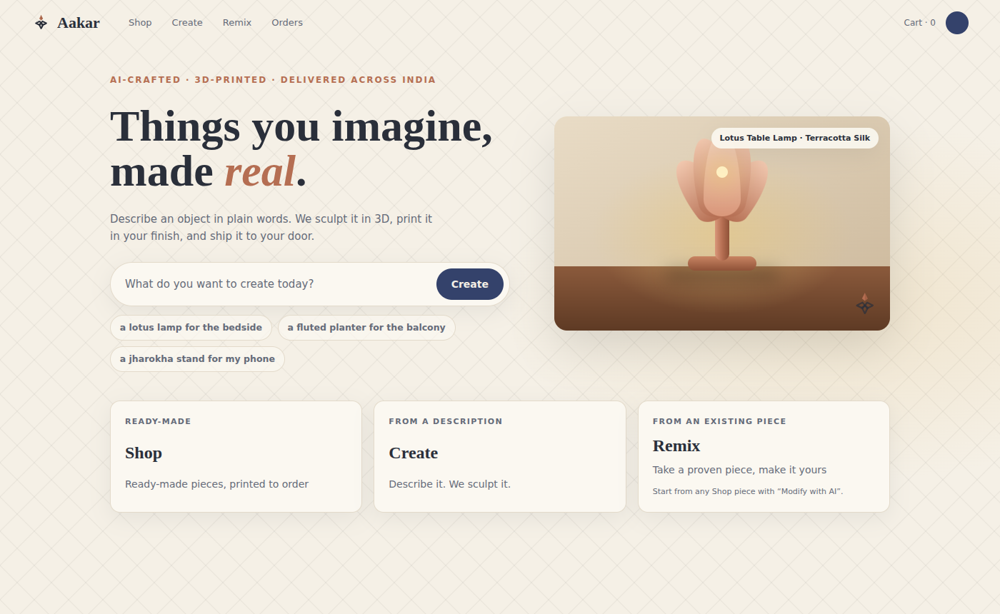
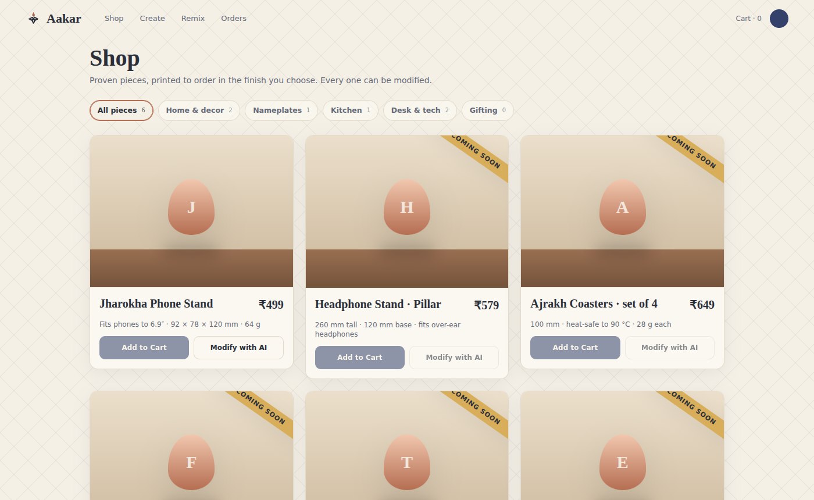
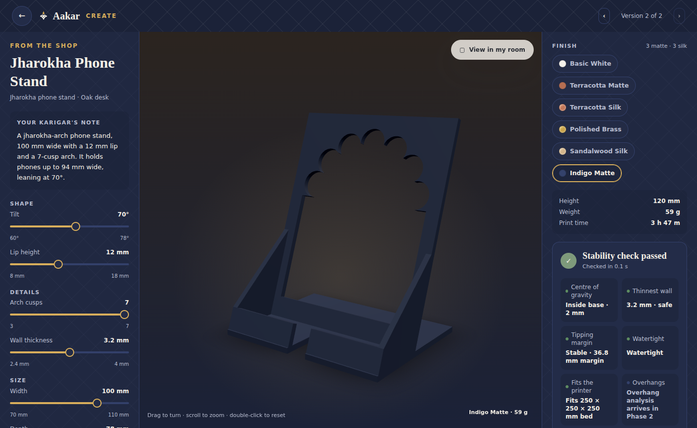
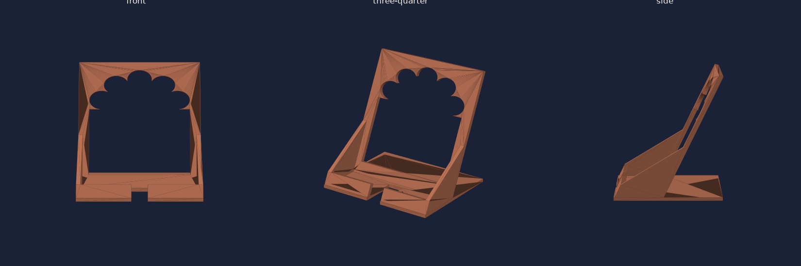

# Aakar

**Aakar** (आकार, *form / shape*) is an AI-assisted 3D printing studio. Describe an object in plain English or Hinglish, sculpt it in 3D in the browser, and have the physical piece printed and shipped anywhere in India.

*Things you imagine, made real.*

| | |
|---|---|
| Plan | [PLAN.md](PLAN.md) — product and engineering plan, phases, architecture |
| Decisions | [docs/adr](docs/adr/README.md) |
| Run it locally | [docs/runbook-local.md](docs/runbook-local.md) |
| Design boards | [design/](design/README.md) |
| Status | **Phase 0 — Foundations** implemented: monorepo, contracts, tokens, first template, API, storefront viewer, local stack, CI |

## Layout

```
apps/web/                  Next.js storefront + viewer (React Three Fiber)
services/api/              Spring Boot modulith (Java 21, Postgres, RabbitMQ)
services/geometry/         Python: parametric templates, CAD, exports, build pipeline, worker
services/inspect/          Python: printability report, print estimate
services/designer/         Phase 2: Claude co-designer agent
services/render/           Phase 2: thumbnails, time-lapse assembly
services/farm-agent/       Phase 1: studio printer bridge
packages/contracts/        JSON Schemas + OpenAPI — change these first
packages/design-tokens/    Brand tokens, material presets, pricing policy
design/                    Exported concept boards, logo, loader
infra/                     docker-compose stack, env example
docs/                      ADRs, runbook
```

## The vertical slice

Phase 0's exit criterion is one template running end to end from a fresh clone:

```
Design Spec ──▶ geometry (build123d) ──▶ GLB / 3MF / STL ──▶ inspect (stability, walls, estimate)
     ▲                                                              │
     │                                                              ▼
 storefront  ◀── SSE stages ── Spring Boot API ── price per finish (paise)
```

```sh
make slice        # builds the Jharokha phone stand into out/slice
make infra        # Postgres, RabbitMQ, MinIO in Docker (or use a local Postgres)
make geometry     # :8081
make api          # :8080 (direct profile: calls geometry over HTTP)
make web          # :3000 → open /shop, click "Modify with AI" on the Jharokha Phone Stand
```

Full instructions, without Docker too, in the [runbook](docs/runbook-local.md).

| Home | Shop | The viewer |
|---|---|---|
|  |  |  |

The first template, straight out of `services/geometry`:



## Principles (from the plan)

1. **Printable by construction.** Geometry comes from constrained parametric templates; every version passes a printability check before it can be priced.
2. **Craft, not CAD.** The UI says sculpt, weave, emboss. Never mesh, vertex, STL.
3. **Proven bases, personal tops.** Personalisation sits on templates that have been printed hundreds of times.
4. **Transparent price, honest preview.** Price from slicer output; materials calibrated against real prints.
5. **Magic moments are engineered.** Time-lapse, unboxing card, AR: each is a feature with an owner.

## Contributing

- Contracts first: change `packages/contracts`, run `make contracts`, then change services.
- Every service has its own README with run and test commands. `make test` runs them all.
- Record decisions as ADRs in `docs/adr`.
